### 목차

| [소개](#소개)                               | [구현](#구현)                                           | [마치며](#마치며)                           |
| :------------------------------------------ | :------------------------------------------------------ | :------------------------------------------ |
| [:book: 개요](#book-개요)                   | [:dart: 주요 페이지 및 기능](#dart-주요-페이지-및-기능) | [:boy: 팀원](#boy-팀원)                     |
| [:bulb: 프로젝트 기획](#bulb-프로젝트-기획) | [:rocket: 기능시연](#rocket-기능시연)                   | [:mega: 소감](#mega-소감)                   |
| [:cactus: 빌드 환경](#cactus-빌드-환경)     | [:eyes: 산출물](#eyes-산출물)                           | [:seedling: 회고 기록](#seedling-회고-기록) |
|                                             | [:books: 파일 구조도](#books-파일-구조도)               |                                             |

<br/>

# 소개

## :book: 개요

**_👏 SSAFY 9기 2학기 자율 프로젝트 👏_**  
PostMan의 오픈소스 서비스를 개발해보자

> 2023.10.09 ~ 2023.011.17 (6주)

<br/>

[🔼 목차로 돌아가기](#목차)

<br/>

## :bulb: 프로젝트 기획

### UCC

[](https://youtu.be/23xa-LyzMoY?si=o_KGtmH2q5kbN55v)

<br/>

### 배경

**"프로젝트 개발에서 PostMan을 필수로 이용하는데, 4명 이상부터는 요금이 나오는게 부담 돼.."**

> 기존의 API 테스트 서비스로 가장 유명한 PostMan은 4명 이상부터 요금이 발생합니다. 최저 요금이 인당 월 14달러(약 18,000원)로 간단한 프로젝트에서는 부담이 될 수 있습니다.
> SAPIER에서는 이러한 API 테스트 서비스를 오픈소스로 구현하는 것을 주제로 하였으며, 무료로 서비스를 이용할 수 있습니다.

**"프론트 개발에서 API 명세서, VScode, 크롬 창, 메신저...등 켜놔야 할 창이 너무 많아 불편해"**

> 프론트엔드 개발자는 켜놔야 하는 창이 많아 창 관리가 필수입니다.
> SAPIER는 크롬 익스텐션 기능을 지원해, API 명세서를 크롬 창 안에서 볼 수 있도록 해서 열린 창 수를 줄일 수 있습니다.

**"워크스페이스가 많아지면 이름으로 구분해야해서 UI가 조금 불편해지는 것 같아"**

> PostMan의 워크스페이스 리스트나 각 요청들의 메소드 및 결과가 직관적인 UI가 아니어서 한 눈에 구분하기 어렵다는 단점이 있습니다.
> MatterMost의 채널 리스트 UI 등을 참고해 좀더 직관적이고 단순한 UI로 디자인을 개선해보고자 했습니다.

<br/>

[🔼 목차로 돌아가기](#목차)

<br/>

## :cactus: 빌드 환경

| FrontEnd                          | BackEnd                                      | Database      | Infra                      |
| :-------------------------------- | :------------------------------------------- | :------------ | :------------------------- |
| Vue 3.3.7                         | Java 17 (Azul Zulu version 17.0.9)           | MongoDB 7.0.2 | AWS EC2 (Ubuntu 20.04 LTS) |
| Vite 5.0.0-beta.12                | Spring Boot 3.1.5                            | Redis 7.2.2   | Nginx 1.18.0               |
| VueUse(core) 10.5.0               | Gradle 8.3                                   |               | GitLab CICD                |
| UnoCSS 0.57.1                     | JPA                                          |               | Jenkins 2.429              |
| vite-plugin-vue-devtolls 1.0.0-rc | IntelliJ IDEA 2023.2.5<br>(Ultimate Edition) |               | Docker 24.0.6              |
| typescript 0.57.1                 | Lombok                                       |               |                            |
| Pnpm 8.9.2                        | Mail                                         |
| Pinia 2.1.7                       | JWT                                          |
| Pinia-plugin-persist 1.0.0        | Spring Data MongoDB                          |
| Pinia-plugin-persistedstate 3.2.0 | Swagger                                      |
| vue-json-pretty 2.2.4             |
| vue-router 4.2.5                  |
| vue3-ts-jsoneditor 2.9.0          |

<br>

[🔼 목차로 돌아가기](#목차)

<br>

# 구현

## :dart: 주요 페이지 및 기능

### Intro

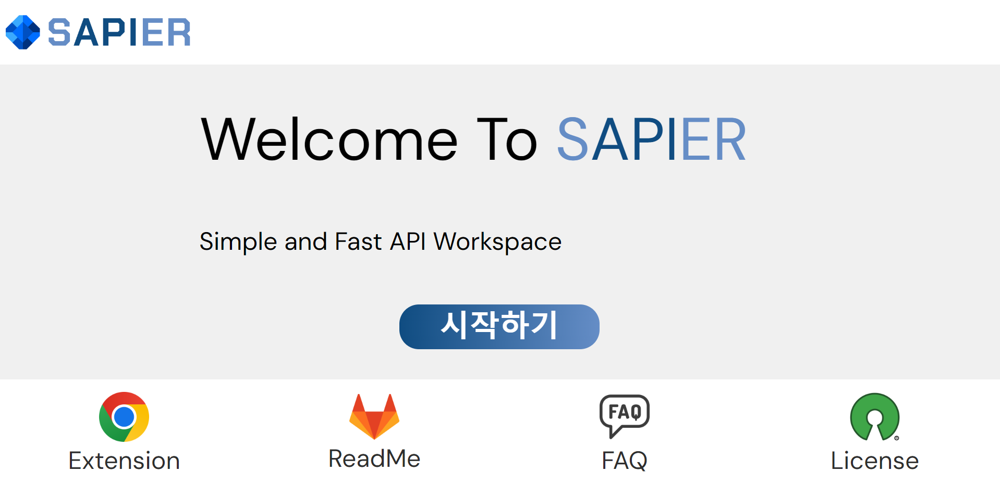

> 인트로 페이지 입니다. '시작하기' 버튼을 누르면 로그인 페이지로 이동합니다.  
> 로그인이 되어있다면 메인 페이지로 이동합니다.

<br>
<br>

### Login & Regist

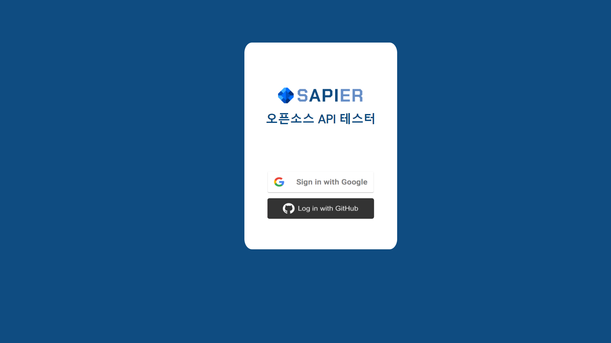

> 로그인 페이지입니다. 구글과 깃허브 소셜 로그인이 가능합니다.  
> 첫 로그인시 회원가입됩니다.

<br>
<br>

### Main

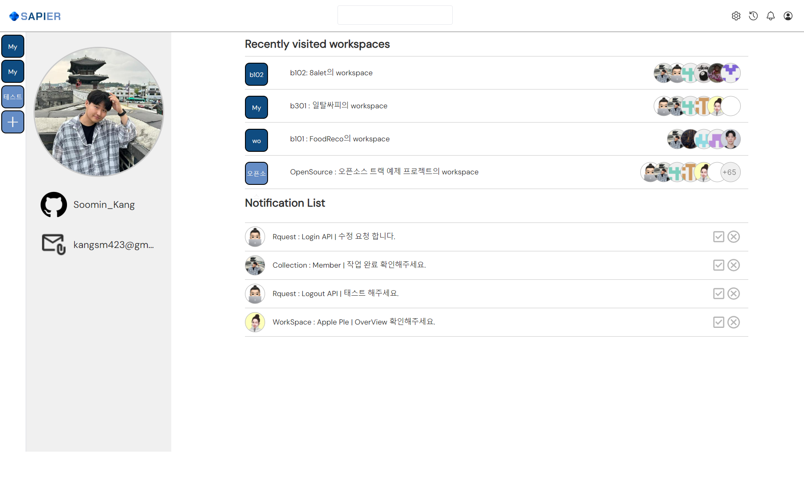

> 메인페이지입니다. 좌측에 워크스페이스 리스트와 로그인한 소셜 계정의 정보가 나타납니다.  
> 최근 방문한 워크스페이스 정보와 알람 리스트가있습니다.

<br>
<br>
   
### Workspace

|                                        Overview                                        |                      Document 생성                       |
| :------------------------------------------------------------------------------------: | :------------------------------------------------------: |
|                  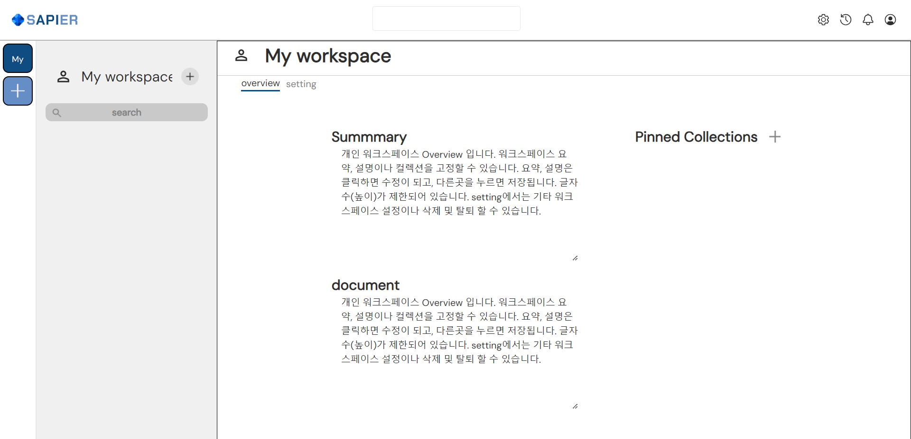                  |  |
| 워크스페이스 첫 화면입니다.<br>간단한 설명 및 내부 컬렉션을 즐겨찾기 해둘 수 있습니다. | 좌측 상단의 '+' 버튼으로 Document를 생성할 수 있습니다.  |

|                   Workspace 수정                    |                                   Workspace 세팅                                    |
| :-------------------------------------------------: | :---------------------------------------------------------------------------------: |
|  |                  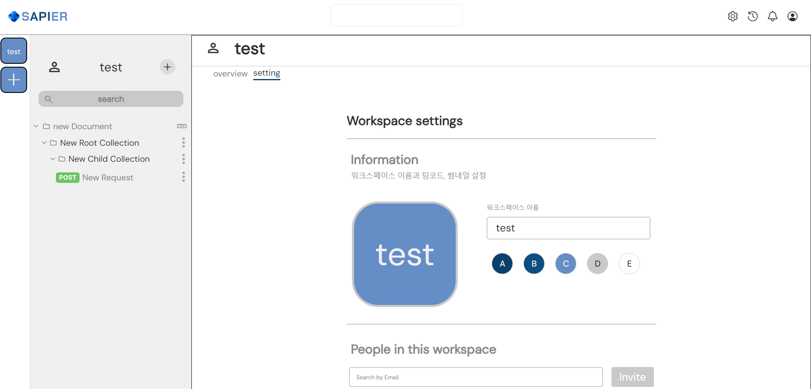                   |
|   워크스페이스에 대한 설명란을 수정한 모습입니다.   | setting탭에 들어간 모습입니다.<br>워크스페이스 이름과 색상 등을 변경할 수 있습니다. |

|                      Workspace 초대                       |                   초대 수락                   |                                   초대 확인                                   |
| :-------------------------------------------------------: | :-------------------------------------------: | :---------------------------------------------------------------------------: |
|     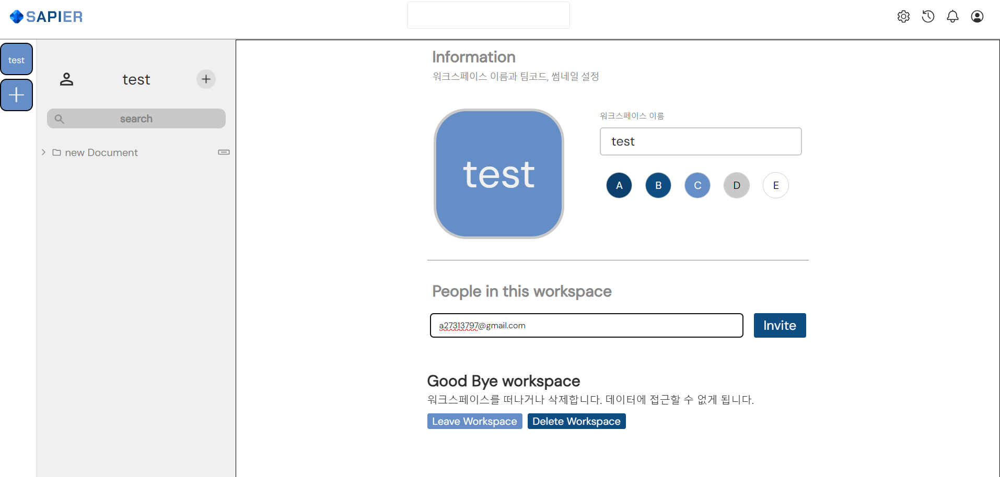      | 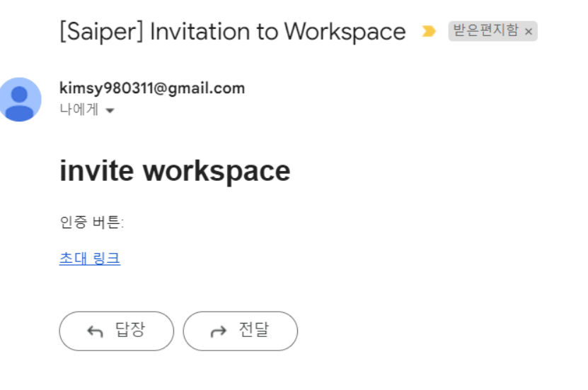  |                 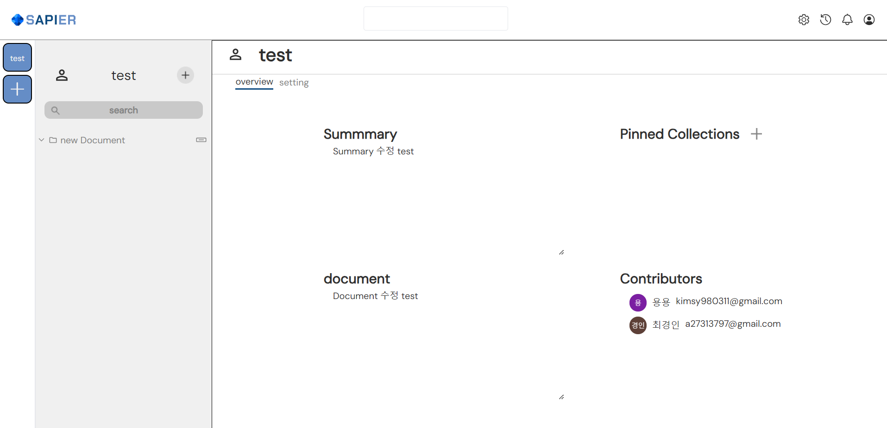                  |
| 이메일로 다른 사용자를 워크스페이스에 초대할 수 있습니다. | 이메일 온 모습이며, 링크를 누르면 수락됩니다. | 초대를 수락하면 Overview 우측 하단에 Contributors에 사용자 목록이 나타납니다. |

|                               사용자 권한 설정                                |                         Workspace 나가기                          |
| :---------------------------------------------------------------------------: | :---------------------------------------------------------------: |
|             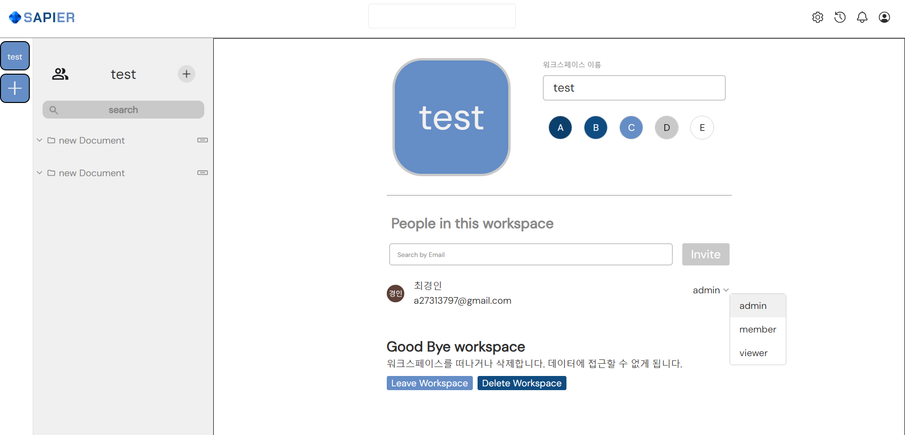              |               |
| 워크스페이스 멤버의 권한을 admin, member, viewer로 나누어 설정할 수 있습니다. | setting 란 최하단에서 워크스페이스를 떠나거나 삭제할 수 있습니다. |

<br>
<br>

### Collection

|                                    Document 옵션                                     |                                                              Collection 옵션                                                               |
| :----------------------------------------------------------------------------------: | :----------------------------------------------------------------------------------------------------------------------------------------: |
|                                         |                                                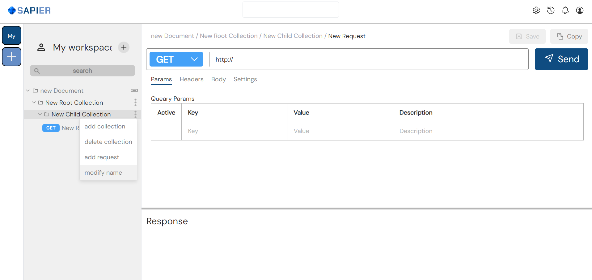                                                 |
| document의 옵션에서 하위 컬렉션추가, 도큐먼트 삭제, 도큐먼트 이름 변경이 가능합니다. | collection의 옵션에서 하위 컬렉션 추가, 컬렉션 삭제, 리퀘스트 추가, 컬렉션 이름 변경이 가능합니다.<br>리퀘스트 옵션에선 삭제가 가능합니다. |

<br><br>

### Request

|                                                          Request 전송                                                           |                                     Request Params                                     |
| :-----------------------------------------------------------------------------------------------------------------------------: | :------------------------------------------------------------------------------------: |
|                                            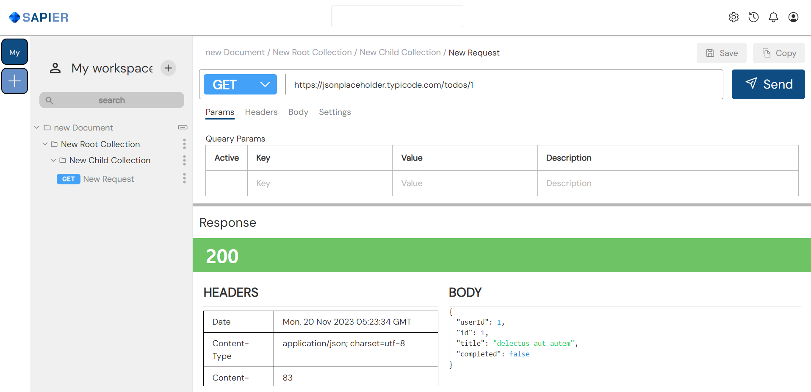                                             |                    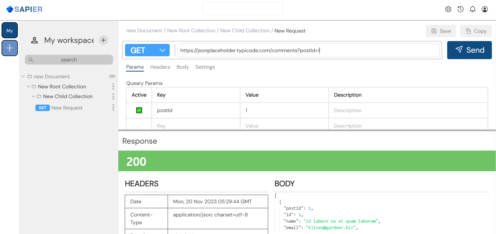                    |
| 메서드를 선택하고 URL을 입력 후 'Send' 버튼을 누르면 API 요청을 보낼 수 있습니다.<br>응답 결과는 하단 Response 란에 나타납니다. | Params 탭에서 파라미터를 수정할 수 있습니다.<br>API요청 시 쿼리 파라미터로 전송됩니다. |

|             Request 메서드              |                                       Request 저장                                       |
| :-------------------------------------: | :--------------------------------------------------------------------------------------: |
| 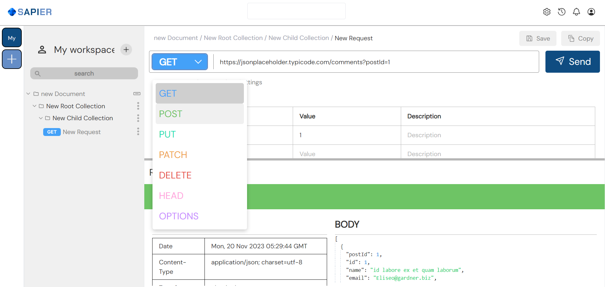 |                       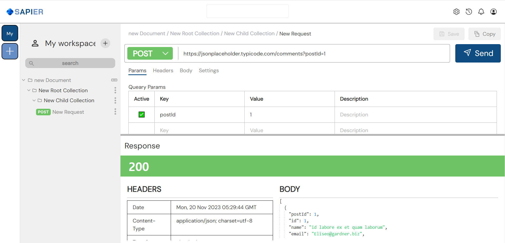                       |
|    http 메서드를 수정할 수 있습니다.    | 리퀘스트에 입력 된 정보를 바꾸면 우측 상단 'Save' 버튼이 활성화 되고, 누르면 저장됩니다. |

|                                                                                Request Headers                                                                                |                                                                Request Body                                                                 |
| :---------------------------------------------------------------------------------------------------------------------------------------------------------------------------: | :-----------------------------------------------------------------------------------------------------------------------------------------: |
|                                                                   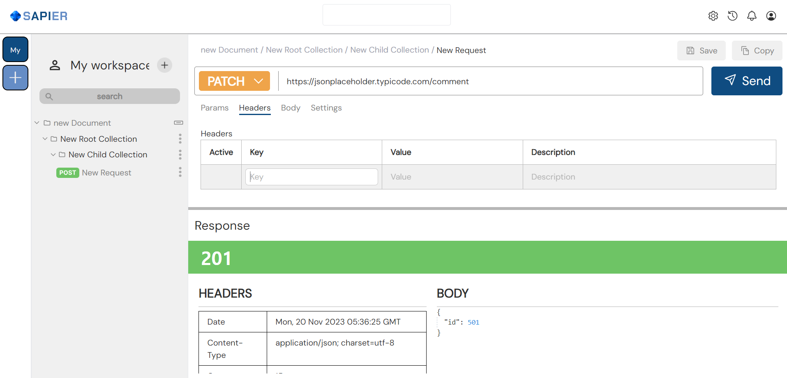                                                                    |                                                  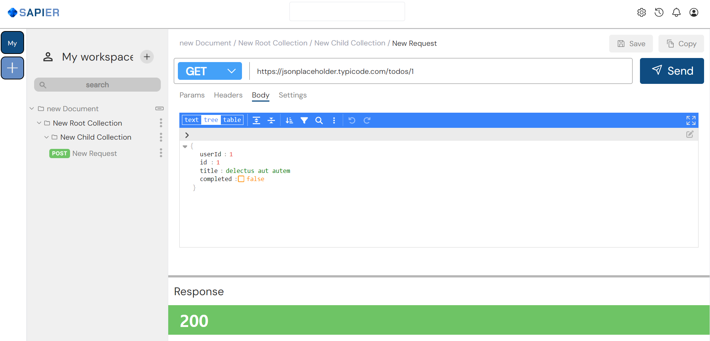                                                   |
| 리퀘스트의 헤더를 설정할 수 있습니다.<br>active 체크박스를 통해 행의 활성/비활성을 설정 할 수 있습니다.<br>key-value로 헤더를 설정하고 Description에 설명을 적을 수 있습니다. | 바디에는 json형식으로 데이터를 담을 수 있습니다.<br>vue3-ts-jsoneditor의 에디터로 데이터를 텍스트 및 트리구조로 확인 및 수정할 수 있습니다. |

|                            Request 400 error                             |                            Request 500 error                             |
| :----------------------------------------------------------------------: | :----------------------------------------------------------------------: |
|                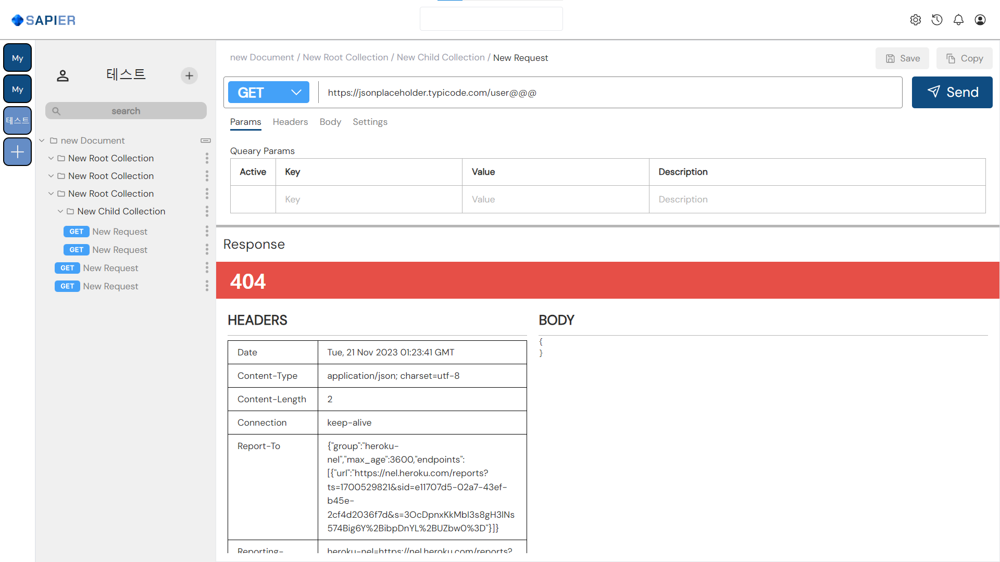                 |                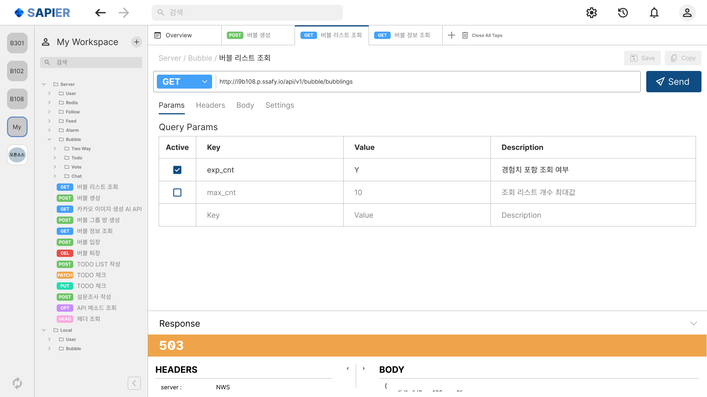                |
| 응답 결과가 404인 모습입니다.<br>상태코드가 붉은색 바와 함께 보여집니다. | 응답 결과가 503인 모습입니다.<br>상태코드가 노란색 바와 함께 보여집니다. |

<br>
<br>

### History

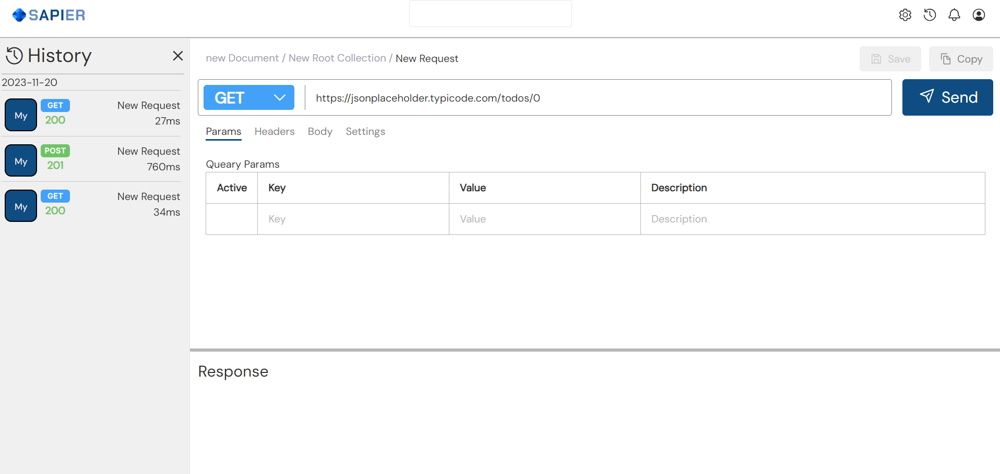

> 보낸 리퀘스트 요청들을 확인할 수 있습니다. 어느 워크스페이스의 무슨 메서드 요청인지 확인할 수 있고, 응답 상태코드와 걸린 시간이 표시됩니다.  
> 히스토리 목록에서 요청기록을 클릭하면, Request와 똑같이 요청정보가 나타나고, 저장이나 요청으로 응답을 확인할 수 있습니다.

<br>
<br>

### Extenstion

|                                                           팝업                                                            |                     로그인 성공                     |
| :-----------------------------------------------------------------------------------------------------------------------: | :-------------------------------------------------: |
|                                                                                                    |         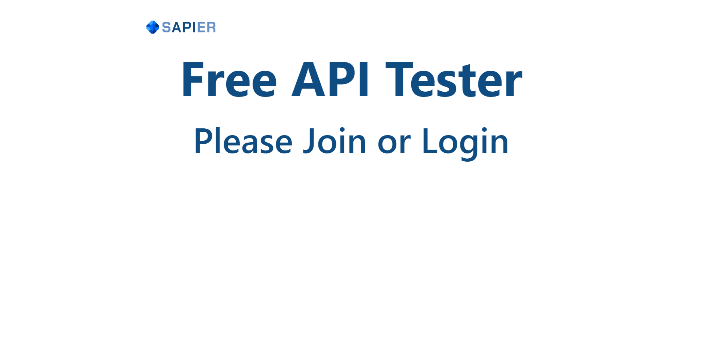         |
| 크롬 확장프로그램으로 SAPIER 서비스를 이용할 수 있도록 구현했습니다.<br>로그인 페이지와 같이 소셜로 로그인할 수 있습니다. | 로그인이 성공하면, 로그인 성공 페이지로 이동합니다. |

|                                                                    플로팅 1                                                                    |                         플로팅 2                          |
| :--------------------------------------------------------------------------------------------------------------------------------------------: | :-------------------------------------------------------: |
|                                                          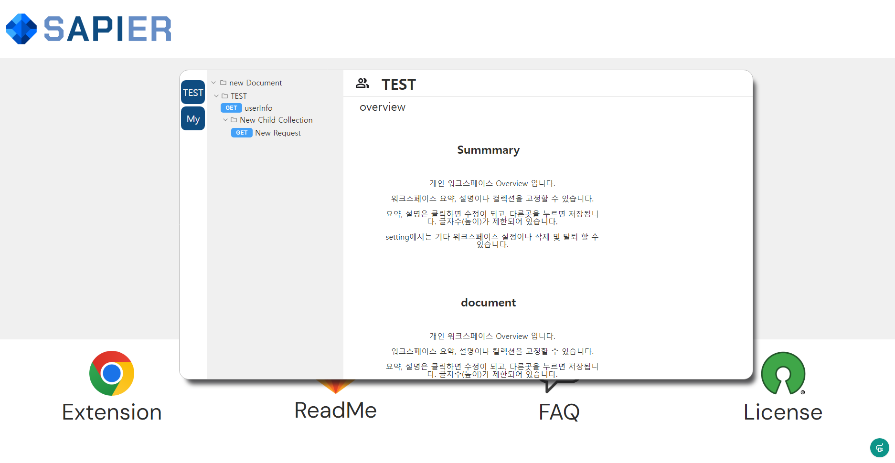                                                           |               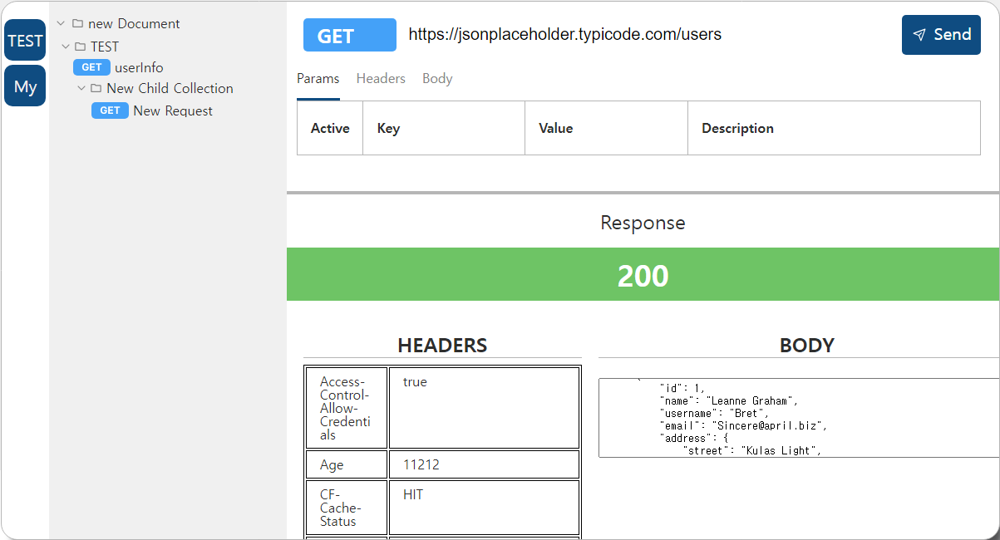               |
| 확장프로그램에서 소셜로그인하면 우측 하단에 버튼이 나타납니다.<br>버튼을 클릭하면 플로팅 페이지가 나타나서 SAPIER 서비스를 이용할 수 있습니다. | 확장프로그램에서 Request를 보내고 응답을 받은 모습입니다. |

<br/>

[🔼 목차로 돌아가기](#목차)

<br/>

## :rocket: 기능시연

|              로그인               |
| :-------------------------------: |
|    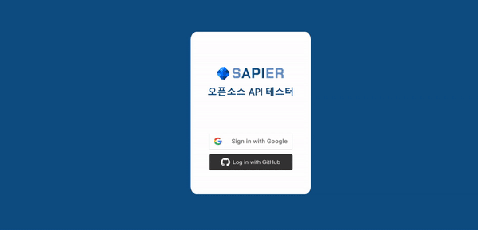    |
| - 소셜 로그인 시 메인 페이지 이동 |

|                                                                    워크스페이스                                                                     |
| :-------------------------------------------------------------------------------------------------------------------------------------------------: |
|                                                     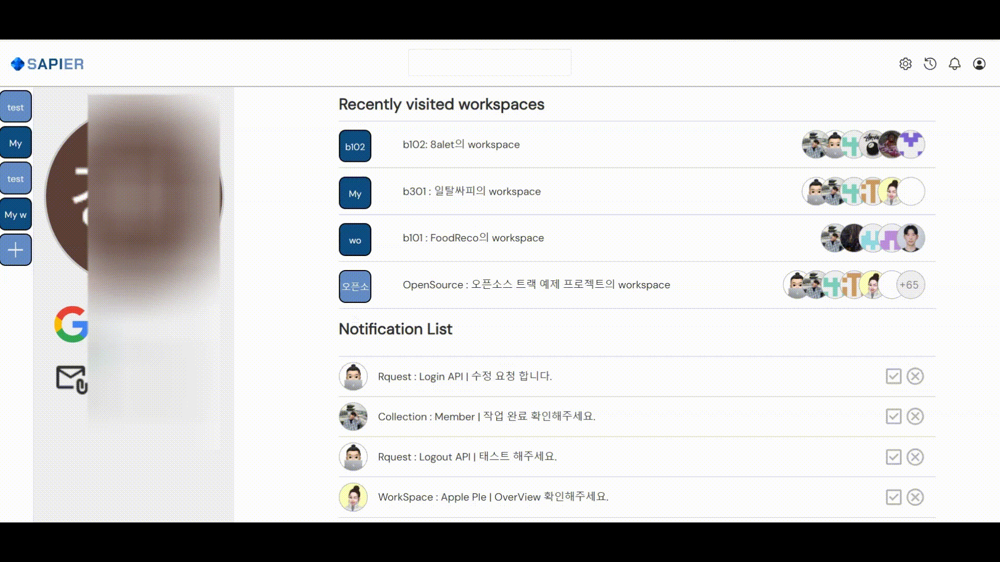                                                     |
| - 워크스페이스 Overview에서 설명 편집 가능<br>- Setting에서 이름, 색상 설정 가능<br>- 이메일로 멤버 초대 가능<br>- 워크스페이스 떠나기 및 삭제 가능 |

|                                                컬렉션                                                |
| :--------------------------------------------------------------------------------------------------: |
|                                 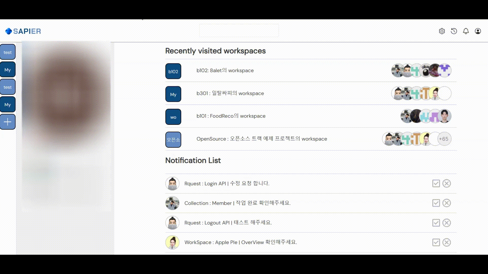                                  |
| - 컬렉션 생성 및 이름 수정, 삭제 가능<br>- 하위 컬렉션 및 리퀘스트 생성 가능<br>- 리퀘스트 삭제 가능 |

|                                                                                                                                                                                                                              리퀘스트                                                                                                                                                                                                                              |
| :----------------------------------------------------------------------------------------------------------------------------------------------------------------------------------------------------------------------------------------------------------------------------------------------------------------------------------------------------------------------------------------------------------------------------------------------------------------: |
|                                                                                                                                                                                                                                                                                                                                                                                                                                         |
| - 컬렉션 리스트에서 리퀘스트를 누르면 우측에 정보 표시<br>- 리퀘스트 제목, 메서드, URL, 파라미터, 헤더, 바디 수정 가능. 수정하면 'Save'버튼이 활성화 되고 누르면 저장 됨<br>- 파라미터와 헤더는 표 형식으로 active를 통해 행 활성/비활성 가능<br>- 입력 된 정보로 요청을 보내 응답 확인가능<br>- 응답은 200대는 초록, 400대는 빨강, 500대는 노랑으로 상태코드와 함께 색상이 표시 됨<br>- 응답 정보는 헤더와 바디로 표시되고, 각각 key-value와 json형식으로 표시 됨 |

|                                                                                                                                  히스토리                                                                                                                                  |
| :------------------------------------------------------------------------------------------------------------------------------------------------------------------------------------------------------------------------------------------------------------------------: |
|                                                                                                                      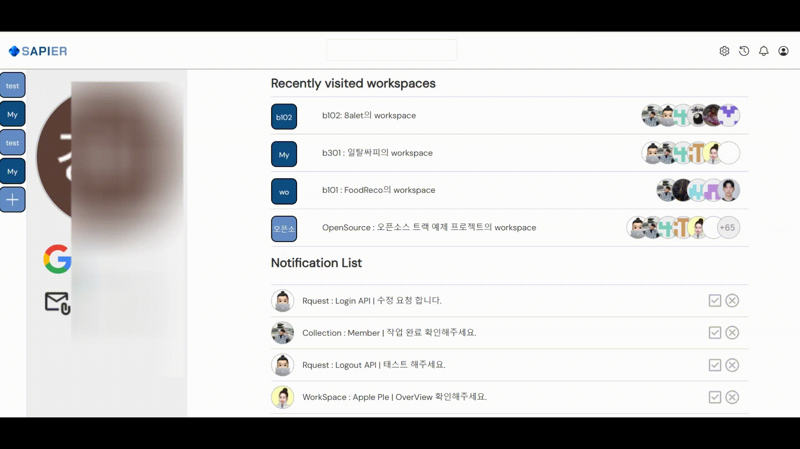                                                                                                                       |
| - 보낸 요청 기록을 확인할 수 있음<br>- 날짜별로 구분되고, 요청이 소속된 워크스페이스가 표시 됨<br>- 요청마다 메서드와 제목이 표시되고, 응답 결과의 상태코드와 소요시간이 나타남<br>- 요청기록을 클릭하면, Request와 마찬가지로 정보가 입력되고, 같은 기능을 사용할 수 있음 |

|             팝업 로그인             |            플로팅 컬렉션            |           플로팅 리퀘스트            |
| :---------------------------------: | :---------------------------------: | :----------------------------------: |
| 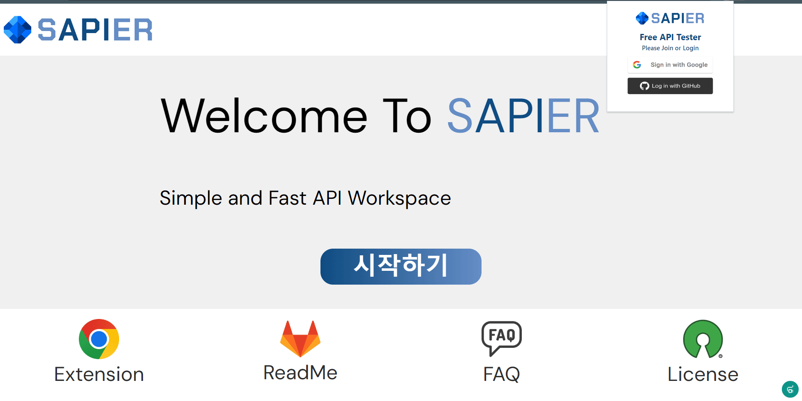 | 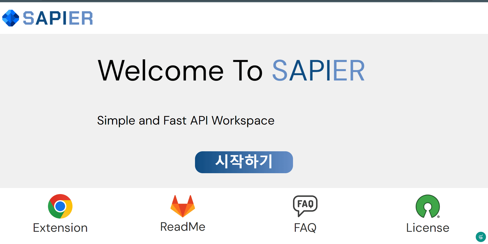 |   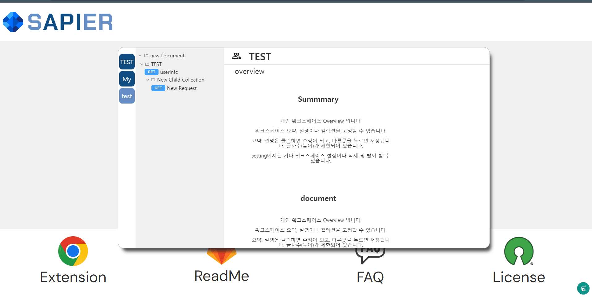    |
|   팝업 소셜로그인 및 성공 페이지    |  플로팅에서 컬렉션 생성/수정/삭제   | 플로팅에서 리퀘스트 요청 및 응답화면 |

<br/>

[🔼 목차로 돌아가기](#목차)

<br/>

## :eyes: 산출물

|               요구사항명세서                |            API 명세서             |
| :-----------------------------------------: | :-------------------------------: |
| 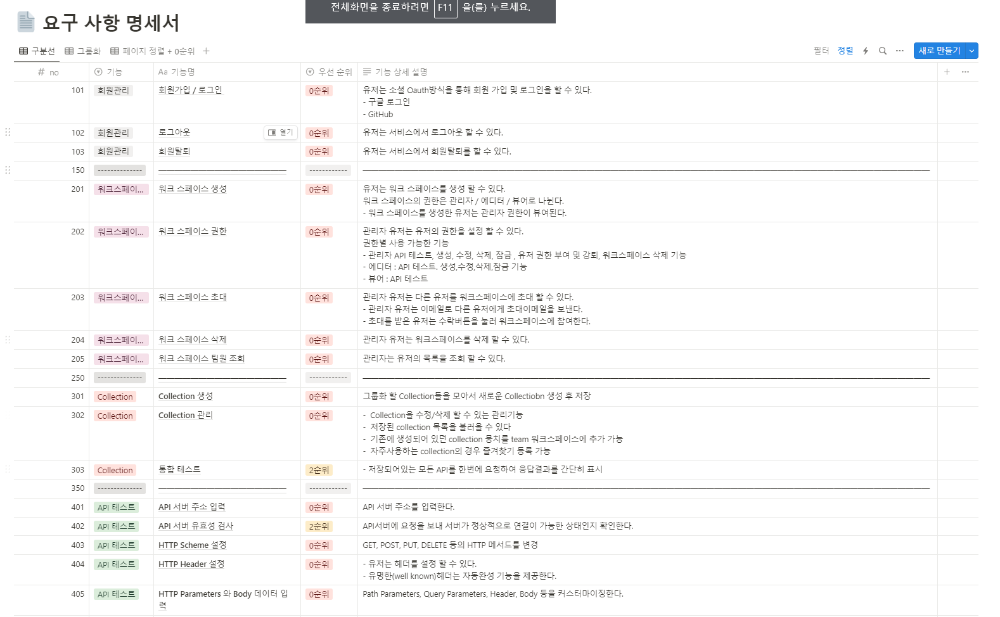 | 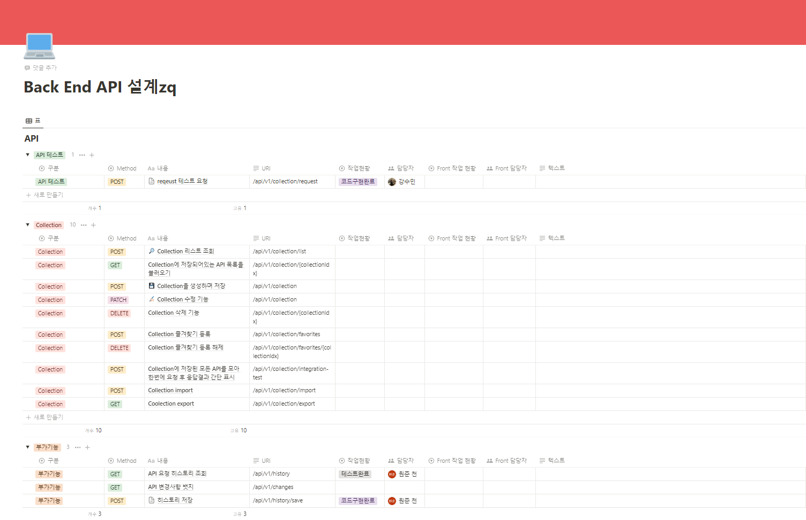 |

|              와이어 프레임              |             목업 디자인             |          데이터플로우          |
| :-------------------------------------: | :---------------------------------: | :----------------------------: |
| 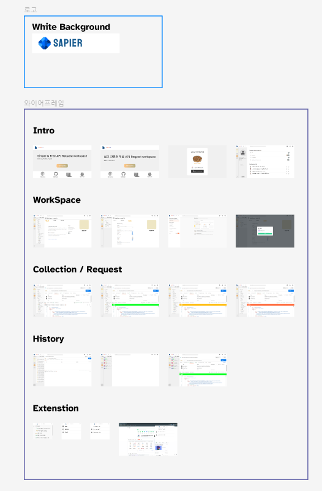 | 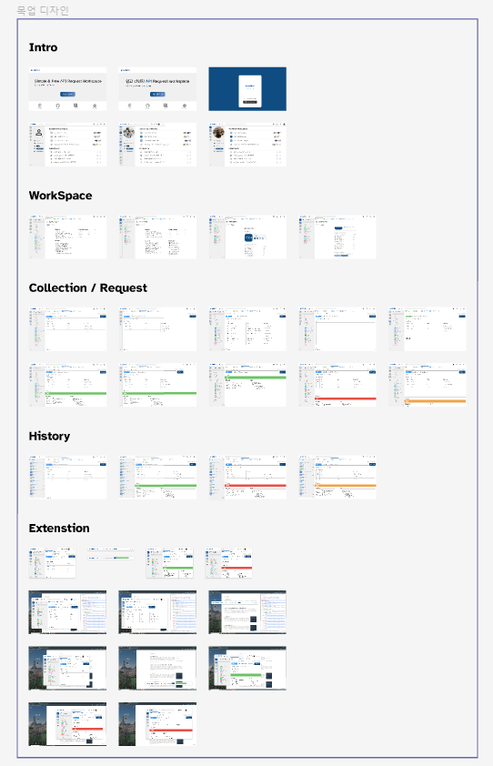 | 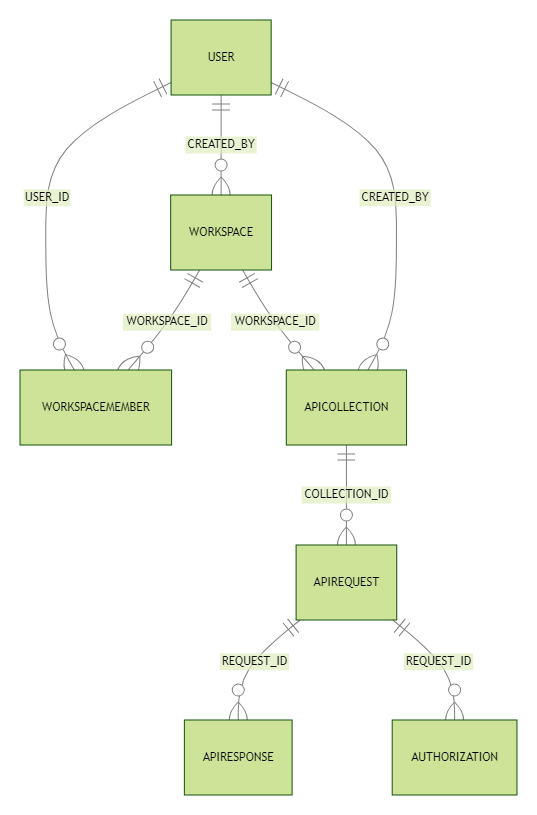 |

|              시스템 구조도              |            지라 이슈            |
| :-------------------------------------: | :-----------------------------: |
|  |  |

### 지라 번다운 차트

|           2주차 스프린트            |           3주차 스프린트            |           4주차 스프린트            |
| :---------------------------------: | :---------------------------------: | :---------------------------------: |
| 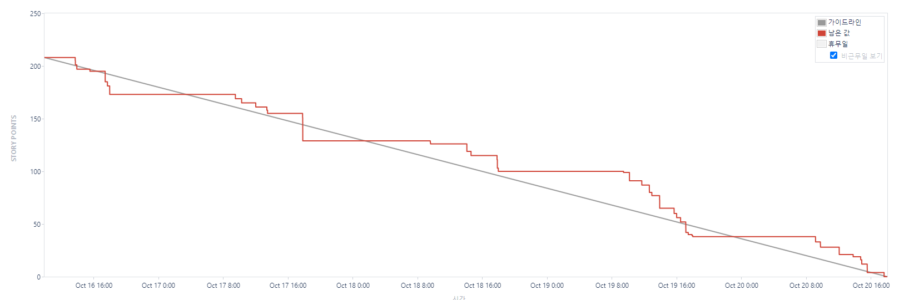 | 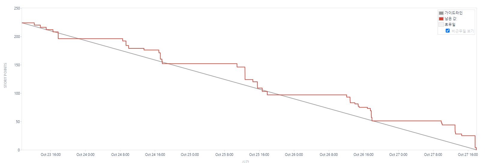 | 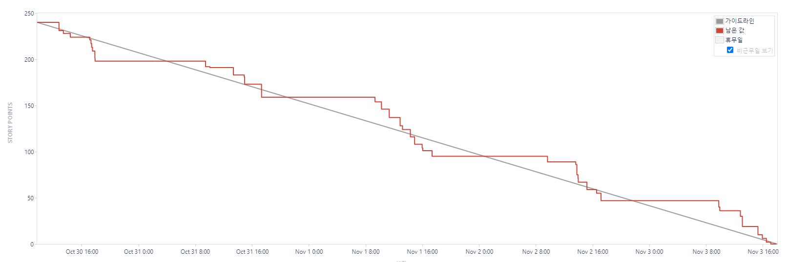 |

|           5주차 스프린트            |           6주차 스프린트            |
| :---------------------------------: | :---------------------------------: |
|  | 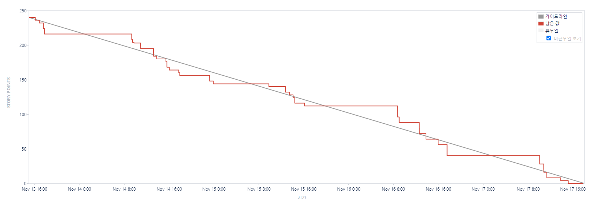 |

### 최종발표 ppt


<br>

[🔼 목차로 돌아가기](#목차)

<br/>

## :books: 파일 구조도

### FrontEnd

```
📦frontend
 ┗ 📂sapier
 ┃ ┣ 📂conf
 ┃ ┣ 📂cypress
 ┃ ┃ ┣ 📂e2e
 ┃ ┣ 📂locales
 ┃ ┃ ┣ 📂disable
 ┃ ┣ 📂public
 ┃ ┣ 📂src
 ┃ ┃ ┣ 📂components
 ┃ ┃ ┃ ┣ 📂history
 ┃ ┃ ┃ ┣ 📂intro
 ┃ ┃ ┃ ┣ 📂login
 ┃ ┃ ┃ ┣ 📂main
 ┃ ┃ ┃ ┣ 📂Request
 ┃ ┃ ┃ ┣ 📂workspace
 ┃ ┃ ┣ 📂composables
 ┃ ┃ ┣ 📂layouts
 ┃ ┃ ┣ 📂modules
 ┃ ┃ ┣ 📂pages
 ┃ ┃ ┃ ┣ 📂histories
 ┃ ┃ ┃ ┣ 📂login
 ┃ ┃ ┃ ┣ 📂work
 ┃ ┃ ┣ 📂plugins
 ┃ ┃ ┣ 📂stores
 ┃ ┃ ┣ 📂styles
 ┃ ┣ 📂test
 ┃ ┃ ┣ 📂__snapshots__
```

### BackEnd

```
📦backend
 ┗ 📂sapaier
 ┃ ┣ 📂build
 ┃ ┃ ┣ 📂classes
 ┃ ┃ ┃ ┗ 📂java
 ┃ ┃ ┃ ┃ ┗ 📂main
 ┃ ┃ ┃ ┃ ┃ ┗ 📂com
 ┃ ┃ ┃ ┃ ┃ ┃ ┗ 📂esfp
 ┃ ┃ ┃ ┃ ┃ ┃ ┃ ┗ 📂sapaier
 ┃ ┃ ┃ ┃ ┃ ┃ ┃ ┃ ┣ 📂domain
 ┃ ┃ ┃ ┃ ┃ ┃ ┃ ┃ ┃ ┣ 📂collection
 ┃ ┃ ┃ ┃ ┃ ┃ ┃ ┃ ┃ ┃ ┣ 📂controller
 ┃ ┃ ┃ ┃ ┃ ┃ ┃ ┃ ┃ ┃ ┣ 📂exception
 ┃ ┃ ┃ ┃ ┃ ┃ ┃ ┃ ┃ ┃ ┣ 📂model
 ┃ ┃ ┃ ┃ ┃ ┃ ┃ ┃ ┃ ┃ ┃ ┣ 📂dto
 ┃ ┃ ┃ ┃ ┃ ┃ ┃ ┃ ┃ ┃ ┃ ┃ ┣ 📂request
 ┃ ┃ ┃ ┃ ┃ ┃ ┃ ┃ ┃ ┃ ┃ ┃ ┗ 📂response
 ┃ ┃ ┃ ┃ ┃ ┃ ┃ ┃ ┃ ┃ ┃ ┗ 📂vo
 ┃ ┃ ┃ ┃ ┃ ┃ ┃ ┃ ┃ ┃ ┣ 📂repository
 ┃ ┃ ┃ ┃ ┃ ┃ ┃ ┃ ┃ ┃ ┃ ┗ 📂entity
 ┃ ┃ ┃ ┃ ┃ ┃ ┃ ┃ ┃ ┃ ┗ 📂service
 ┃ ┃ ┃ ┃ ┃ ┃ ┃ ┃ ┃ ┣ 📂history
 ┃ ┃ ┃ ┃ ┃ ┃ ┃ ┃ ┃ ┃ ┣ 📂controller
 ┃ ┃ ┃ ┃ ┃ ┃ ┃ ┃ ┃ ┃ ┣ 📂model
 ┃ ┃ ┃ ┃ ┃ ┃ ┃ ┃ ┃ ┃ ┃ ┗ 📂dto
 ┃ ┃ ┃ ┃ ┃ ┃ ┃ ┃ ┃ ┃ ┃ ┃ ┗ 📂request
 ┃ ┃ ┃ ┃ ┃ ┃ ┃ ┃ ┃ ┃ ┣ 📂repository
 ┃ ┃ ┃ ┃ ┃ ┃ ┃ ┃ ┃ ┃ ┃ ┗ 📂entity
 ┃ ┃ ┃ ┃ ┃ ┃ ┃ ┃ ┃ ┃ ┗ 📂service
 ┃ ┃ ┃ ┃ ┃ ┃ ┃ ┃ ┃ ┣ 📂user
 ┃ ┃ ┃ ┃ ┃ ┃ ┃ ┃ ┃ ┃ ┣ 📂controller
 ┃ ┃ ┃ ┃ ┃ ┃ ┃ ┃ ┃ ┃ ┣ 📂model
 ┃ ┃ ┃ ┃ ┃ ┃ ┃ ┃ ┃ ┃ ┃ ┣ 📂dto
 ┃ ┃ ┃ ┃ ┃ ┃ ┃ ┃ ┃ ┃ ┃ ┗ 📂vo
 ┃ ┃ ┃ ┃ ┃ ┃ ┃ ┃ ┃ ┃ ┣ 📂repository
 ┃ ┃ ┃ ┃ ┃ ┃ ┃ ┃ ┃ ┃ ┃ ┣ 📂entity
 ┃ ┃ ┃ ┃ ┃ ┃ ┃ ┃ ┃ ┃ ┗ 📂service
 ┃ ┃ ┃ ┃ ┃ ┃ ┃ ┃ ┃ ┗ 📂workspace
 ┃ ┃ ┃ ┃ ┃ ┃ ┃ ┃ ┃ ┃ ┣ 📂controller
 ┃ ┃ ┃ ┃ ┃ ┃ ┃ ┃ ┃ ┃ ┣ 📂document
 ┃ ┃ ┃ ┃ ┃ ┃ ┃ ┃ ┃ ┃ ┣ 📂dto
 ┃ ┃ ┃ ┃ ┃ ┃ ┃ ┃ ┃ ┃ ┣ 📂exception
 ┃ ┃ ┃ ┃ ┃ ┃ ┃ ┃ ┃ ┃ ┣ 📂repository
 ┃ ┃ ┃ ┃ ┃ ┃ ┃ ┃ ┃ ┃ ┗ 📂service
 ┃ ┃ ┃ ┃ ┃ ┃ ┃ ┃ ┣ 📂global
 ┃ ┃ ┃ ┃ ┃ ┃ ┃ ┃ ┃ ┣ 📂auth
 ┃ ┃ ┃ ┃ ┃ ┃ ┃ ┃ ┃ ┃ ┣ 📂exception
 ┃ ┃ ┃ ┃ ┃ ┃ ┃ ┃ ┃ ┃ ┣ 📂filter
 ┃ ┃ ┃ ┃ ┃ ┃ ┃ ┃ ┃ ┃ ┣ 📂handler
 ┃ ┃ ┃ ┃ ┃ ┃ ┃ ┃ ┃ ┃ ┣ 📂model
 ┃ ┃ ┃ ┃ ┃ ┃ ┃ ┃ ┃ ┃ ┃ ┣ 📂dto
 ┃ ┃ ┃ ┃ ┃ ┃ ┃ ┃ ┃ ┃ ┃ ┗ 📂vo
 ┃ ┃ ┃ ┃ ┃ ┃ ┃ ┃ ┃ ┃ ┣ 📂repository
 ┃ ┃ ┃ ┃ ┃ ┃ ┃ ┃ ┃ ┃ ┃ ┣ 📂entity
 ┃ ┃ ┃ ┃ ┃ ┃ ┃ ┃ ┃ ┃ ┣ 📂service
 ┃ ┃ ┃ ┃ ┃ ┃ ┃ ┃ ┃ ┃ ┗ 📂util
 ┃ ┃ ┃ ┃ ┃ ┃ ┃ ┃ ┃ ┗ 📂config
 ┃ ┃ ┣ 📂generated
 ┃ ┃ ┃ ┗ 📂sources
 ┃ ┃ ┃ ┃ ┣ 📂annotationProcessor
 ┃ ┃ ┃ ┃ ┃ ┗ 📂java
 ┃ ┃ ┃ ┃ ┃ ┃ ┗ 📂main
 ┃ ┃ ┃ ┃ ┗ 📂headers
 ┃ ┃ ┃ ┃ ┃ ┗ 📂java
 ┃ ┃ ┃ ┃ ┃ ┃ ┗ 📂main
 ┃ ┃ ┣ 📂resources
 ┃ ┃ ┃ ┗ 📂main
 ┃ ┃ ┗ 📂tmp
 ┃ ┃ ┃ ┗ 📂compileJava
 ┃ ┃ ┃ ┃ ┣ 📂compileTransaction
 ┃ ┃ ┃ ┃ ┃ ┣ 📂backup-dir
 ┃ ┃ ┃ ┃ ┃ ┗ 📂stash-dir
 ┃ ┣ 📂docs
 ┃ ┣ 📂gradle
 ┃ ┃ ┗ 📂wrapper
 ┃ ┣ 📂src
 ┃ ┃ ┣ 📂main
 ┃ ┃ ┃ ┣ 📂java
 ┃ ┃ ┃ ┃ ┗ 📂com
 ┃ ┃ ┃ ┃ ┃ ┗ 📂esfp
 ┃ ┃ ┃ ┃ ┃ ┃ ┗ 📂sapaier
 ┃ ┃ ┃ ┃ ┃ ┃ ┃ ┣ 📂domain
 ┃ ┃ ┃ ┃ ┃ ┃ ┃ ┃ ┣ 📂collection
 ┃ ┃ ┃ ┃ ┃ ┃ ┃ ┃ ┃ ┣ 📂controller
 ┃ ┃ ┃ ┃ ┃ ┃ ┃ ┃ ┃ ┣ 📂exception
 ┃ ┃ ┃ ┃ ┃ ┃ ┃ ┃ ┃ ┣ 📂model
 ┃ ┃ ┃ ┃ ┃ ┃ ┃ ┃ ┃ ┃ ┣ 📂dto
 ┃ ┃ ┃ ┃ ┃ ┃ ┃ ┃ ┃ ┃ ┃ ┣ 📂request
 ┃ ┃ ┃ ┃ ┃ ┃ ┃ ┃ ┃ ┃ ┃ ┗ 📂response
 ┃ ┃ ┃ ┃ ┃ ┃ ┃ ┃ ┃ ┃ ┗ 📂vo
 ┃ ┃ ┃ ┃ ┃ ┃ ┃ ┃ ┃ ┣ 📂repository
 ┃ ┃ ┃ ┃ ┃ ┃ ┃ ┃ ┃ ┃ ┣ 📂entity
 ┃ ┃ ┃ ┃ ┃ ┃ ┃ ┃ ┃ ┗ 📂service
 ┃ ┃ ┃ ┃ ┃ ┃ ┃ ┃ ┣ 📂history
 ┃ ┃ ┃ ┃ ┃ ┃ ┃ ┃ ┃ ┣ 📂controller
 ┃ ┃ ┃ ┃ ┃ ┃ ┃ ┃ ┃ ┣ 📂model
 ┃ ┃ ┃ ┃ ┃ ┃ ┃ ┃ ┃ ┃ ┗ 📂dto
 ┃ ┃ ┃ ┃ ┃ ┃ ┃ ┃ ┃ ┃ ┃ ┣ 📂request
 ┃ ┃ ┃ ┃ ┃ ┃ ┃ ┃ ┃ ┣ 📂repository
 ┃ ┃ ┃ ┃ ┃ ┃ ┃ ┃ ┃ ┃ ┣ 📂entity
 ┃ ┃ ┃ ┃ ┃ ┃ ┃ ┃ ┃ ┗ 📂service
 ┃ ┃ ┃ ┃ ┃ ┃ ┃ ┃ ┣ 📂user
 ┃ ┃ ┃ ┃ ┃ ┃ ┃ ┃ ┃ ┣ 📂controller
 ┃ ┃ ┃ ┃ ┃ ┃ ┃ ┃ ┃ ┣ 📂model
 ┃ ┃ ┃ ┃ ┃ ┃ ┃ ┃ ┃ ┃ ┣ 📂dto
 ┃ ┃ ┃ ┃ ┃ ┃ ┃ ┃ ┃ ┃ ┗ 📂vo
 ┃ ┃ ┃ ┃ ┃ ┃ ┃ ┃ ┃ ┣ 📂repository
 ┃ ┃ ┃ ┃ ┃ ┃ ┃ ┃ ┃ ┃ ┣ 📂entity
 ┃ ┃ ┃ ┃ ┃ ┃ ┃ ┃ ┃ ┗ 📂service
 ┃ ┃ ┃ ┃ ┃ ┃ ┃ ┃ ┗ 📂workspace
 ┃ ┃ ┃ ┃ ┃ ┃ ┃ ┃ ┃ ┣ 📂controller
 ┃ ┃ ┃ ┃ ┃ ┃ ┃ ┃ ┃ ┣ 📂document
 ┃ ┃ ┃ ┃ ┃ ┃ ┃ ┃ ┃ ┣ 📂dto
 ┃ ┃ ┃ ┃ ┃ ┃ ┃ ┃ ┃ ┣ 📂exception
 ┃ ┃ ┃ ┃ ┃ ┃ ┃ ┃ ┃ ┣ 📂repository
 ┃ ┃ ┃ ┃ ┃ ┃ ┃ ┃ ┃ ┗ 📂service
 ┃ ┃ ┃ ┃ ┃ ┃ ┃ ┣ 📂global
 ┃ ┃ ┃ ┃ ┃ ┃ ┃ ┃ ┣ 📂auth
 ┃ ┃ ┃ ┃ ┃ ┃ ┃ ┃ ┃ ┣ 📂exception
 ┃ ┃ ┃ ┃ ┃ ┃ ┃ ┃ ┃ ┣ 📂filter
 ┃ ┃ ┃ ┃ ┃ ┃ ┃ ┃ ┃ ┣ 📂handler
 ┃ ┃ ┃ ┃ ┃ ┃ ┃ ┃ ┃ ┣ 📂model
 ┃ ┃ ┃ ┃ ┃ ┃ ┃ ┃ ┃ ┃ ┣ 📂dto
 ┃ ┃ ┃ ┃ ┃ ┃ ┃ ┃ ┃ ┃ ┗ 📂vo
 ┃ ┃ ┃ ┃ ┃ ┃ ┃ ┃ ┃ ┣ 📂repository
 ┃ ┃ ┃ ┃ ┃ ┃ ┃ ┃ ┃ ┃ ┣ 📂entity
 ┃ ┃ ┃ ┃ ┃ ┃ ┃ ┃ ┃ ┣ 📂service
 ┃ ┃ ┃ ┃ ┃ ┃ ┃ ┃ ┃ ┗ 📂util
 ┃ ┃ ┃ ┃ ┃ ┃ ┃ ┃ ┗ 📂config
 ┃ ┃ ┃ ┃ ┃ ┃ ┃ ┃ ┃ ┣ 📂mail
 ┃ ┃ ┃ ┗ 📂resources
 ┃ ┃ ┗ 📂test
 ┃ ┃ ┃ ┗ 📂java
 ┃ ┃ ┃ ┃ ┗ 📂com
 ┃ ┃ ┃ ┃ ┃ ┗ 📂esfp
 ┃ ┃ ┃ ┃ ┃ ┃ ┗ 📂sapaier
```

<br/>

[🔼 목차로 돌아가기](#목차)

<br/>

# 마치며

## :boy: 팀원

| [강수민](https://github.com/Jade-Good) | [김승용](https://github.com/kimsy98) | [김재원](https://github.com/Kanaloa21) | [조성락(팀장)](https://github.com/sju3358) | [천원준](https://github.com/wonjunchun) | [최경인](https://github.com/Fizioo0102) |
| :------------------------------------: | :----------------------------------: | :------------------------------------: | :----------------------------------------: | :-------------------------------------: | :-------------------------------------: |
|             |           |             |                 |              |              |
|  FE Leader<br>BackEnd<br>PM<br>Design  |         BackEnd<br>FrontEnd          |         FrontEnd<br>Extension          |      BackEnd<br>FrontEnd<br>DataBase       |      BackEnd<br>FrontEnd<br>Infra       |           BackEnd<br>FrontEnd           |

### 팀원 역할 상세

**_강수민_**

- BE : Request API 요청 처리
- FE
  - Request 컴포넌트 구현
  - Params 컴포넌트 구현
  - Headers 컴포넌트 구현
  - Body 컴포넌트 구현
  - Response 컴포넌트 구현
  - JSON Viewer & Editor 적용
  - Request, Response 창 조절 이벤트 구현
  - Category, Collection Tree 컴포넌트 리펙토링
    - 재귀 구조 정리
    - Props 및 이벤트 정리
- 와이어 프레임, 목업 디자인
- 스크럼, 데일리 회고 관리

**_김승용_**

- Spring Boot 와 mongo data JPA를 활용한 Workspace 기능 API 구현
- Spring Boot를 활용한 메일 초대 기능 구현
- Vue3를 활용한 페이지 구현

  - WorkSpace 생성 컴포넌트
  - overview 컴포넌트
  - setting 컴포넌트

**_김재원_**

- Vue3를 사용한 프론트엔드 구현
  - Pinia를 사용한 상태관리
  - 메인 페이지 구현
  - 라우트 네비게이션 가드 구현
- 크롬 익스텐션 개발

  - 팝업페이지, 인젝션 스크립트 페이지 구현
  - 로그인 팝업, 워크스페이스 플로팅 페이지 구현

**_조성락_**

- Spring Security를 이용한 인증/인가
  - Oauth2.0을 이용한 소셜로그인 구현(구글, 깃헙)
  - 유저 권한에 따른 허용가능 API 분리
- JWT 토튼 발급, 재발급 및 커스텀 필터 구현
- Vue3를 이용한 홈페이지 화면구현
  - 로그인 화면
  - 인트로 화면
  - 유저정보 화면

**_천원준_**

- Docker, Jenkins를 활용한 Front-End, Back-End CI/CD 파이프라인 구축
- Spring Boot 및 MongoDB 활용한 History 기능 API 구현
- Vue.js3 활용한 History 페이지 화면 구현

**_최경인_**

- UCC 촬영/제작
- collection의 트리형식 폴더 구조를 중첩리스트와 Vue.js를 사용하여 구현
- spring boot와 mongo data JPA 를 활용한 folder 구조 CRUD REST API 구현

<br/>

[🔼 목차로 돌아가기](#목차)

<br/>

## :mega: 소감

**_강수민_**

> 포스트맨 같은 API 테스트 서비스를 구현했더니 HTTP 통신에 대해서 많이 알게된 것 같다. 프론트/백을 넘어 개발 분야에 필수적인 지식을 쌓고, 실력을 늘릴 수 있었던 좋은 경험이었다.  
> 상용 서비스인 포스트맨의 기능들을 클론 코딩하듯 직접 따라해 구현해보니 생각보다 디테일한 기능들이 많이 들이 들어간 것을 알 수 있었다. 클론코딩을 처음 해본 거였는데 배울점이 참 많았던 것 같다.  
> 프론트를 메인으로 잡는 인원이 없어서 6인 풀스택으로 진행했는데, 돌아보니 비효율적인 부분들이 많았던 것 같다.  
> 도메인 간의 소통이 미흡했던 것도 있는 것 같아 프로젝트 진행 방식에 대해서 규칙을 정하고 효율성을 따지는게 얼마나 중요한지 배울 수 있었다.

**_김승용_**

> 프로젝트를 팀원들과 함께 무사히 마무리를 잘 해서 좋았다.  
> 풀스택의 고충을 알 것 같았다. 각자 페이지를 도맞아 하였는데 데이터를 공통으로 사용하는 부분에서 많은 문제가 되었다.  
> 상태관리에 대한 부분을 조금 더 처음에 신경써서 해야겠다.

**_김재원_**

> 웹 페이지에서 벗어나 확장프로그램을 만드는 작업은 매우 어려운 일이었지만 새롭고 도전적인 과정이었다.  
> 상태관리가 매우 중요한 일이란것을 알게되었다. 생명주기를 정확히 알아야 이런 라이브러리들을 더 잘 다룰 수 있겠다는 생각이 들었다.  
> 코드 컨벤션과 코드리뷰의 중요성을 알게되었다. 웹페이지의 코드를 확장프로그램으로 옮기려할 때 각자가 만든 컴포넌트의 문법도 컨벤션도 달라 상당히 애를 먹었다.

**_조성락_**

> Security에 대해서 언젠간 정복하고싶었는데 이번에 많이 사용해봐서 좋았다.  
> 정복까지는 못했지만 흐름과 개념을 잡을 수 있었고, 앞으로 공부하는데 도움이 많이 되었다.

**_천원준_**

> 이번 기회에 ci cd를 담당하여 인프라에 대한 이해도를 높일 수 있는 좋은 경험이었다.  
> 이전 프로젝트에서 백엔드만 맡아오다가 프론트엔드도 맡게되니 백엔드와 프론트엔드 간의 구체적이고 명확한 의사소통이 왜 중요한지 깨닫게 되었다.

**_최경인_**

> 언젠가 한번은 프론트 맛좀 봐야지 했었는데 직접 경험해보니 생각외로 쉽지않았다. ( FE는 한번으로 족한다… )  
> 맡은 파트는 BE + FE 모두 담당한 full stack 이여서 혼자 만들다보니 다른 파트와 공유되는 부분 에서 소통이 부족했던것 같다.  
> rdbms 사용하지 않고 nosql만 사용해본적은 처음이였는데 nosql을 효율적으로 사용하는 방법에 대해서 좀 더 익혀봐야할것같다.  
> 쿼리를 열심히 짜보고 싶었는데 생각외로 쿼리를 짤 일이 없었어서 아쉬웠다.  
> 그래도 프로젝트가 무사히 마무리 되어서 뿌듯하고 FULL STACK은 감히 쉽게 넘볼 수 없다라는 생각이 들었다. 하나라도 잘하자!

<br/>

[🔼 목차로 돌아가기](#목차)

<br/>

## :seedling: 회고 기록

### [🔷 스크럼 & 스프린트 회고](./scrum/README.md)

### 🔷 데일리 회고

- [강수민 데일리 회고](./review/강수민/README.MD)
- [김승용 데일리 회고](./review/김승용/README.MD)
- [김재원 데일리 회고](./review/김재원/README.MD)
- [조성락 데일리 회고](./review/조성락/README.MD)
- [천원준 데일리 회고](./review/천원준/README.MD)
- [최경인 데일리 회고](./review/최경인/README.MD)

<br/>

[🔼 목차로 돌아가기](#목차)
